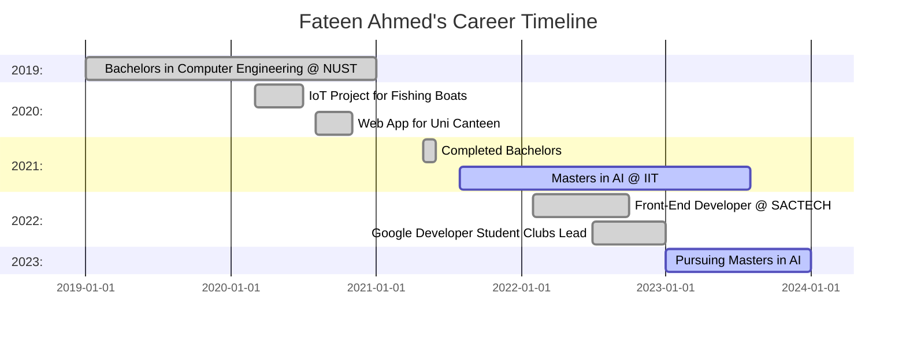

# FATEEN AHMED

> "Pioneering the intersection of AI, life, and binary trees."

📍 **Location**: Chicago, United States  
📧 **Email**: [fateenahmed.2k@gmail.com](mailto:fateenahmed.2k@gmail.com)  
📞 **Contact**: +1 8045286071

---

## 🌐 Personal Matrix

| Dimension        | Details           |
|------------------|------------------|
| **Coordinate 1** | Masters in AI at Illinois Institute of Technology |
| **Coordinate 2** | Passion for building user-centric AI/ML solutions  |
| **Coordinate 3** | Gaming enthusiast & strategy lover                |

---
# 🖥️ Fateen Ahmed's Computer Science Odyssey 🚀

---

## 🛠️ My Toolkit 🎒
* **Programming Languages**: Python 🐍, Java ☕, C++, JavaScript 🪲
* **Web Tech**: HTML 📄, CSS 🎨, PHP 🐘, Node.js 🟢
* **Scripting Powers**: Bash 🐚, PowerShell ⚡
* **AI/ML**: TensorFlow 🧠, PyTorch 🔥, scikit-learn 📊, Keras ⚙️
* **Web Frameworks**: React ⚛️, Angular 🅰️, Vue.js 🌱
* **Backend**: Django 🦄, Flask 🍶, Express.js 🚆
* **Database Know-how**: SQL (MySQL, PostgreSQL) 📚, NoSQL (MongoDB) 🍃
* **Cloud Platforms**: AWS 🌩️, Google Cloud ☁️, Azure 🌌
* **DevOps & CI/CD**: Jenkins, Travis CI, Docker 🐳, Kubernetes ⛴
* **IoT**: Raspberry Pi 🥧, MQTT 📡
* **IDEs**: Jupyter Notebook 📓, Google Colab ☁️
  
---

## 📜 Career Timeline 🛤️

## 🤖 Artificial Intelligence Mastery 🧠

- **Algorithms**: 
  - Supervised 🍎
  - Unsupervised 👓
  - NLP 🗣
  - Computer Vision 👁
  - Deep Learning 🕳
  
- **Data Processing**: 
  - ETL 🔄
  - Cleaning 🧽
  - Visualization (Tableau, PowerBI) 📊

## 🔌 IoT Expertise 🌍

- **Hardware**: 
  - Sensor Integration 🌡️
  - GPS Modules 🛰️
  - Circuit Design 🔌
  
- **Electronics**: 
  - Microcontrollers 🎮
  - Embedded Systems 🖲

---

## 🕹️ Gaming Interests

Exploring the vast graph of gaming, I often traverse between strategy nodes and role-playing clusters. Connect with me for a co-op traversal on Discord!

---

## 📜 Certifications & Extras

- Encoded in Google's `Data Analytics` Algorithm
- Rewarded with the `Dean's List` Token

---

🔗 Connect with me in the vast web of internet:
💼 [LinkedIn](https://www.linkedin.com/in/fateen-ahmed-a5b1171b6/) | 🐦 [Portfolio](https://bento.me/fateen)
